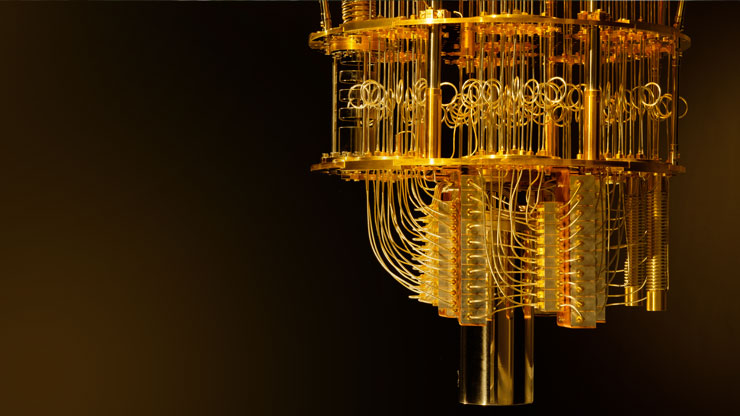

# Quantum Computing Resources

[Quantum computing](https://en.wikipedia.org/wiki/Quantum_computing) is the use of quantum phenomena such as superposition and entanglement to perform computation.
It is a field that will revolutionise the world. Quantum compuing can be used for special kinds of problems that cannot be solved by the classical computers.
It is highly recommended to learn in the given order if you are a beginner. You can skip reading the articles. Watching videos alone is more than enough to gain basic intuition.

## CONTENTS
- [Getting Started](#Getting-Started)
- [Getting started with Quantum mechanics](#Getting-started-with-Quantum-mechanics)
- [Lot more resources to be added soon](#Lot-more-resources-will-be-updated-soon....)

## Getting Started

Videos :

- [How will quantum computing change the world?](https://www.youtube.com/watch?v=dDOn_n7tNyo)
- [Quantum Computers Explained – Limits of Human Technology](https://www.youtube.com/watch?v=JhHMJCUmq28)
- [Quantum Computers - FULLY Explained!](https://www.youtube.com/watch?v=PzL-oXxNGVM)
- [How Quantum Computers Could Change the World](https://www.youtube.com/watch?v=kEJBxotcxRw)

Articles :

- [What is Quantum Computing?](https://www.technologyreview.com/2019/01/29/66141/what-is-quantum-computing/)
- [What is Quantum Computing and how does it work?](https://builtin.com/hardware/quantum-computing)

## Getting started with Quantum mechanics

Videos :

- [Schrödinger's cat experiment - Understanding superposition](https://www.youtube.com/watch?v=UjaAxUO6-Uw)
- [What does Schrödinger's Cat explain to us?](https://www.youtube.com/watch?v=67MG6_N0msg)
- [Quantum Entanglemnt - 'Spooky action at a distance'](https://www.youtube.com/watch?v=z1GCnycbMeA)
- [Understanding Quantum Mechanics - Superposition and Entanglement](https://www.youtube.com/watch?v=j6Mw3_tOcNI)

## Lot more resources will be updated soon....
